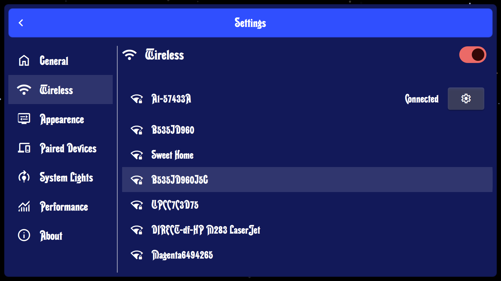

# Talking Clock

⏰ A customizable **alarm clock** for the **Raspberry Pi 4**, powered by a **Yocto Embedded Linux** image.
It displays the time and date, controls **WS2811 LED strips**, and will soon feature a **local LLM** to wake you up with custom spoken outputs.


## ✨ Features

* Large, stylish digital clock display
* WS2811 LED control (static, waving, mono rotation)
* Adjustable brightness, color, and animation speed
* Wireless connectivity & system settings interface
* Powered by a **custom Yocto Embedded Linux image**
* (Coming soon) Local **LLM integration** for whacky personalized wake-up messages


## 🚀 Getting Started (Try using Talking Clock)

### Hardware Requirements

* Raspberry Pi 4 (4GB+ recommended)
* MicroSD card (16GB or larger)
* WS2811 LED strip
* Power supply

### Software Requirements

* QtCreator
* Qt 6.8
* docker

## 🔧 Building with Yocto Container

To simplify building, a **Yocto container** is available: [hub.docker.com/r/micaah42/yocto](https://hub.docker.com/r/micaah42/yocto). This will help you keep all files bundled up and make it easier to have multiple yocto project versions or machines at once.

### 1. Pull the container

```bash
docker pull micaah42/yocto
```

### 2. Run the container

Start an interactive session:

```bash
docker run -it --name yocto-build micaah42/yocto /bin/bash
```

Alternatively, you can run it in the background and connect via SSH if you’ve enabled it.

### 3. Clone the Yocto layer repository

```bash
git clone --recurse-submodules https://github.com/micaah42/talking-clock-yocto.git
cd talking-clock-yocto
```

### 4. Initialize the Yocto build environment

```bash
source poky/oe-init-build-env
```

### 5. Build the custom clock image

```bash
bitbake clock-image
```

> **_NOTE:_**  This can take a loong time, make sure the container can run freely and maybe even detach from the session. Using `-k` may also be useful as this will keep bitbake going after a recipe failed to build.

The resulting *clock-image.rpi.sdimg` file can be flashed to an SD card and booted on your Raspberry Pi 4.


## 🖥️ Screenshots





## 🔮 Roadmap

* [x] Clock + Date Display
* [x] WS2811 LED Control
* [x] Alarm Functionality
* [ ] Local LLM wake-up assistant


## 🛠️ Development

Clone the repository:

```bash
git clone --recurse-submodules https://github.com/micaah42/talking-clock.git
```

Open CMakeLists.txt with QtCreator


## 📜 License

GPL-3.0 license 
